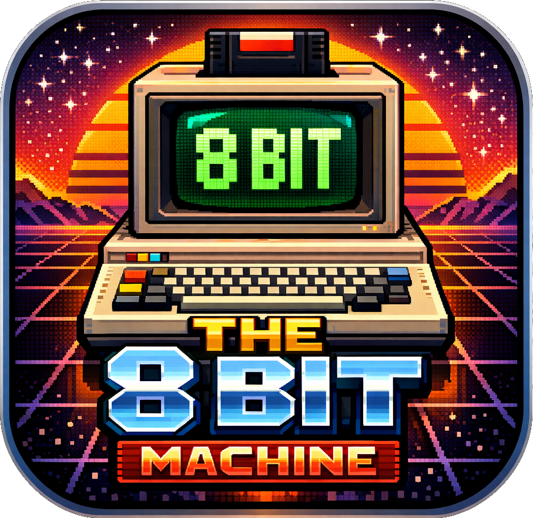

# The 8-Bit Machine

<p align="center">
  
</p>

A general-purpose **8-bit machine designer** written in C++17.

Design your own 8-bit computer: pick a CPU architecture, add components (RAM, timers, I/O ports, …), and wire them into the address space — all at runtime, with a live debugger watching every cycle.

The architecture is intentionally extensible: new CPUs and bus devices are defined by implementing a simple interface (`ICPU` / `IBusDevice`), so the community can contribute new chips without touching the core.

The default machine that ships out of the box is a **MOS 8502** system (the CPU from the Commodore 128) with 64 KB RAM, two CIA 6526 timer/IO chips, and a debug character-output port.

---

## Current State  (v0.31.0)

### Machine Designer
- **`IBusDevice` interface** — any chip or peripheral implements `reset()`, `clock()`, `read(offset)`, `write(offset, value)`, and `statusLine()` for the designer panel. Devices that expose an ImGui debug panel also implement the separate **`IHasPanel`** interface (`drawPanel()`), keeping UI knowledge out of the core device contract
- **`ICPU` interface** — any CPU implements `reset()`, `clock()`, `irq()`, `nmi()`, `complete()`, `stateString()`
- **Dynamic address-space map** — devices are registered with `bus.addDevice(start, end, device)` in priority order; unmatched reads return `$FF` (open bus)
- **Machine class** — owns device instances, builds the default address map, exposes typed accessors for the UI
- **Machine Designer panel** (View menu) — fully interactive address map: add/remove devices, click Start/End to edit addresses inline, drag rows to reorder bus priority, Sort by Address, Reset to Defaults; validation highlights unreachable entries (orange), invalid ranges (red), and missing catch-all (yellow warning)

### CPU  (selectable)

**MOS 8502** (default), **MOS 6510**, **WDC 65C02**, and **Zilog Z80** — all selectable live in the Machine Designer panel.

Shared (`CPU6502Base`):
- All 56 legal 6502 opcodes, all 13 addressing modes
- Cycle-accurate timing with page-cross and branch penalties
- IRQ and NMI with full stack push and vector load
- BRK / RTI with correct flag handling
- Illegal opcodes mapped to extended NOP

MOS 8502 additions:
- NMOS indirect JMP page-wrap bug reproduced

WDC 65C02 additions:
- 27 CMOS-only opcodes: BRA, STZ, TRB, TSB, INA, DEA, PHX, PHY, PLX, PLY, BIT immediate
- Zero-page indirect `($zp)` and absolute indexed indirect `($abs,X)` addressing modes
- JMP indirect page-wrap bug fixed

Zilog Z80:
- Full register set: main (AF, BC, DE, HL) + alternate (AF′ BC′ DE′ HL′), IX, IY, I, R, SP, PC
- All unprefixed opcodes + prefix groups CB, ED, DD (IX), FD (IY), DDCB, FDCB
- Structured decode (x/y/z/p/q bit fields) covering every documented opcode
- Block transfers: LDIR, LDDR, CPIR, CPDR, INIR, INDR, OTIR, OTDR
- Interrupt modes IM 0 / IM 1 / IM 2; EI delay (one instruction after EI before IRQ is taken)
- NMI edge-triggered at `$0066`; RETN restores IFF1 from IFF2
- Port I/O callbacks: `setPortHandlers(read, write)` for IN/OUT routing

### GUI
- Dockable panel layout (Dear ImGui docking branch)
- Standard menu bar — File / Emulator / View / Debug / Help
- **Screen panel** — live framebuffer display; dimensions switch dynamically when the preset changes (400×280 for C64/VIC, 352×272 for ZX Spectrum/ULA); C64: 320×200 active area + 40 px border, character mode with embedded font, color RAM, fine scroll; Spectrum: 256×192 active area + 48 px / 40 px border, pixel+attribute rendering with flash, 16-colour palette (normal + bright)
- **Terminal panel** — green-on-black scrollable log with command input
- **CPU State panel** — live register and flag display, CIA1 timer status, cycle counter
- **Disassembler panel** (Debug menu) — live disassembly with Follow PC, Go To address, highlighted current instruction; click any row to toggle a breakpoint (red `●`); emulator halts automatically when PC hits a breakpoint; known addresses annotated with dim `; LABEL` comments (preset-specific KERNAL/ROM entry points + universal `CHAR_OUT`)
- **Breakpoints panel** (Debug menu) — sorted list of all active breakpoints; click to navigate the Disassembler; `x` to delete individually; Clear All; hex input to add a breakpoint by address
- **Watchpoints** (Debug menu) — break on memory read, write, or both at a specific address; per-entry R/W toggles; terminal prints address and direction when triggered
- **Memory Viewer panel** (Debug menu) — full hex editor (imgui_memory_editor); click any byte to edit in-place, Follow PC toggle, PC highlighted in yellow, built-in data preview and column options; ROM regions shown in amber, I/O devices in blue, legend bar shows color key; ROM edit toggle allows patching ROM data in-place for debugging
- **Per-device panels** (View menu) — each chip that implements `IHasPanel` gets its own dockable window; CIA shows timers/ICR/TOD/ports, VIC shows raster/colours/control, SID shows voices/filter/volume; panels are listed dynamically based on what is mounted; keyboard-owning devices (CIA1, ULA) include a collapsible **Keyboard Matrix** section with a clickable grid for injecting key presses
- **Machine Designer panel** (View menu) — interactive address map: click Start/End addresses to edit inline (invalid values stay red, Tab commits like Enter, clicking away persists red so you can re-enter), drag `=` handle to reorder priority, Sort by Address, Reset to Defaults; validation highlights unreachable entries (orange) and invalid ranges (red), warns when no catch-all entry is present; **Contained Devices** section lists chips embedded inside container devices (VIC/SID/CIA inside C64IOSpace) with live computed addresses
- **File → New Machine** — resets to a blank default map (MOS 8502, VIC+SID+CIA1+CIA2, 64 KB RAM); clears any active preset and stops the emulator
- **ROM loading** (File → Load ROM) — native macOS file dialog; supports raw `.bin` and Commodore `.prg`; resets CPU and jumps disassembler to load address
- **Keyboard capture** — click the Screen panel to direct SDL key events to `Machine::keyEvent()`; each preset wires its own handler (C64 → CIA1 matrix, Spectrum → ULA matrix); Escape calls `Machine::clearKeys()` and releases capture; generic machines receive no key events until a handler is wired
- **Machine config save / load** (File → Save / Load Machine Config) — persists the address-space wiring as a JSON file so machines can be recalled and shared; `cycles_per_frame` is written/read so emulator speed is restored automatically
- **Bundled JSON presets** (File → Load Preset) — `presets/` folder next to the executable is scanned at startup; each `.json` file appears as a submenu entry; a generic ROM picker dialog collects the required ROM images and builds the machine; C64 preset auto-sets ~1 MHz clock speed
- **C64IOSpace as designer device** — the C64 I/O dispatcher appears in the Machine Designer Add Device dropdown (`C64 I/O Space`) so custom machines can mount it manually

### Emulator core
- 64 KB flat RAM; reset vector points to the loaded program or the built-in NOP stub at `$0200`
- **C64 memory map** — `Machine::buildC64Preset()` mounts KERNAL/BASIC/CHAR ROMs, creates a `C64IOSpace` dispatcher for `$D000–$DFFF`, three `SwitchableRegion`s (`$A000`, `$D000`, `$E000`), and a catch-all 64 KB RAM; the MOS 6510 I/O port `$01` drives all three regions via the C64 banking truth table (LORAM/HIRAM/CHAREN bits); preset auto-sets ~1 MHz (16 667 cycles/frame)
- **VIC color RAM** at `$D800–$DBFF` — 1 KB, 4 bits per cell, initialized to `$0E` (light blue); per-character foreground color read during rendering; CPU-accessible via `C64IOSpace`
- **VIC X/Y fine scroll** — `XSCROLL` (`$D016` bits 0–2) and `YSCROLL` (`$D011` bits 0–2) shift the character grid 0–7 pixels in each axis
- **CIA1 (MOS 6526) at `$F100–$F1FF`** — Timer A + Timer B (ϕ2 or TA-underflow count mode), full ADSR envelope, ICR mask/flags, TOD BCD clock with alarm and latch-on-read, data ports PRA/PRB; CIA1 IRQ wired to CPU IRQ line
- **CIA2 at `$F200–$F2FF`** — same full implementation as CIA1
- **SID6581 at `$D400–$D7FF`** — all 29 MOS 6581/8580 registers; SDL audio output at 44100 Hz; triangle/sawtooth/pulse/noise waveforms with correct 23-bit LFSR; full ADSR envelopes with datasheet-accurate timing; master volume; Machine Designer shows volume, filter cutoff, and voice 1 frequency
- **ZX Spectrum 48K preset** — `presets/spectrum48.json`; ROM picker loads the 16 KB Spectrum ROM at `$0000–$3FFF`; 48 KB RAM at `$4000–$FFFF`; Zilog Z80 CPU; ULA device handles display, keyboard, and frame interrupt
- **ULA (ZX Spectrum ULA)** — 352×272 RGBA framebuffer; pixel data decoded from `$4000` using the Spectrum address interleaving formula; 8×8 attribute cells at `$5800` (ink/paper/bright/flash); frame IRQ fired every 69 888 T-states (50 Hz at 3.5 MHz); port `$FE` read returns keyboard half-row, write sets border colour; flash toggles every 16 frames; drawPanel shows border colour, frame counter, flash state, and key matrix
- **Apple IIe preset** — `presets/apple2e.json`; ROM picker auto-detects 12 KB, 16 KB, or 32 KB ROM images and mounts them at the correct address (`$D000` or `$C000`); 48 KB RAM at `$0000–$BFFF`; WDC 65C02 CPU at ~1 MHz
- **AppleIIVideo** — 280×192 green-phosphor framebuffer; text mode: 40×24 characters from an embedded 128-character ROM with inverse and flash rendering; hi-res mode: monochrome 280×192 bitmap; mixed mode: bottom 4 rows text; page 1/2 soft switches
- **AppleIIIO** — keyboard latch at `$C000`, strobe clear at `$C010`, soft switches at `$C050–$C057` (GRAPHICS/TEXT/FULLSCR/MIXED/PAGE1/PAGE2/LORES/HIRES); SDL key events translated to Apple II ASCII including shift and control
- **Drive 1541** — MOS 1541 software IEC state machine; mounts `.d64` and `.t64` images via Peripherals menu; debug panel shows bus line state, transfer log, and directory listing
- **Warp load** — opt-in toggle in the Drive panel (off by default); when enabled and an image is mounted, a `WarpLoadTrap` intercepts the KERNAL ILOAD entry (`$F533`) and injects file bytes directly into RAM without IEC bus activity; standard IEC loading is used when the toggle is off; `[Warp] Loaded …` confirmation printed to terminal when active
- **Epyx FastLoad cartridge** — 8 KB ROM at `$8000–$9FFF` with capacitor-based 512-cycle enable window; IO1/IO2 ranges routed through `C64IOSpace`; mount `.bin` image via Peripherals menu
- **CHAR_OUT port at `$F000`** — CPU writes here appear in the Terminal panel (line-buffered; flushed on LF)
- **F10 instruction step** — runs the CPU until the current instruction completes
- **Configurable clock speed** — Emulator → Speed presets: ~60 kHz (debug), ~500 kHz, ~1 MHz, ~2 MHz; effective MHz shown in the menu bar

### ROM development
- `roms/test.s` — CIA1 Timer A interrupt demo: patches the IRQ vector at runtime, programs CIA1 Timer A to fire ~5× per second (at 60 kHz debug speed), then spins in a loop while the IRQ handler writes `*` + newline to the terminal on every timer tick
- `roms/sid_demo.s` — SID audio demo: three sections (plain voices → LP filter sweep → hard sync + ring mod), two-voice C major scale; load and press F5 to hear audio
- `roms/keyboard_test.s` — CIA1 keyboard matrix scanner: scans all 8 columns each frame, prints `CcRr` + newline per key press to the terminal
- `roms/sid_playground.s` — Interactive SID synthesizer: keys QWERTYUI play notes C4–C5, VIC screen shows active note and key indicators, border colour changes per note; load and press F5, click Screen panel, then play
- `build.sh` assembles all `roms/*.s` files via ca65/ld65 before building the C++ emulator

---

## Prerequisites

| Tool | Install |
|------|---------|
| CMake ≥ 3.20 | `brew install cmake` |
| SDL2 | `brew install sdl2` |
| cc65 (ca65/ld65) | `brew install cc65` |
| C++17 compiler | Xcode Command Line Tools (`xcode-select --install`) |

Dear ImGui (docking branch, v1.91.6) is fetched automatically by CMake.

cc65 is only needed to rebuild the 6502 assembly ROMs from source. The build script skips the assembly step with a warning if cc65 is not installed.

---

## Building

```bash
./build.sh             # Debug build (default)
./build.sh Release     # Release build
```

Or manually:

```bash
cmake -B build -DCMAKE_BUILD_TYPE=Debug
cmake --build build --parallel
```

The binary is placed at `build/the-8-bit-machine`.

---

## Running

```bash
./build/the-8-bit-machine
```

The UI layout is saved to `imgui_layout.ini` so panel positions persist between sessions.

---

## Keyboard Shortcuts

| Key | Action |
|-----|--------|
| F5  | Run emulator |
| F6  | Pause emulator |
| F8  | Reset (reloads reset vector, clears registers) |
| F10 | Step one instruction |

---

## Project Structure

```
the-8-bit-machine/
├── CMakeLists.txt    CMake build; cmake --build build --target roms assembles all ROMs
├── build.sh          One-shot script: assemble ROMs then build the emulator
├── roms/             6502 assembly source (.s) and linker configs (.cfg)
└── src/
    ├── main.cpp
    ├── gui/          Application window, ImGui panels, file dialogs
    └── emulator/
        ├── core/     Bus router, Machine owner, IBusDevice / ICPU interfaces
        ├── cpu/      6502-family CPU implementations + disassembler
        └── devices/  Chip implementations (CIA, SID, VIC, RAM, …)
```

### How the address space works

`Bus` holds a priority-ordered list of `DeviceEntry` records (`start`, `end`, `IBusDevice*`, `label`).  On every read or write the bus walks the list and delegates to the first matching device, passing `addr - entry.start` as the offset.  The special CHAR_OUT port (`$F000`) is intercepted before the list walk.

Device instances are owned by `Machine`.  The default map is:

| Priority | Range | Device |
|----------|-------|--------|
| 1 | `$D000–$D3FF` | VIC-IIe (MOS 6566) |
| 2 | `$F100–$F1FF` | CIA1 (MOS 6526) |
| 3 | `$F200–$F2FF` | CIA2 (MOS 6526) |
| 4 | `$F000` | CHAR_OUT debug port |
| 5 | `$0000–$FFFF` | 64 KB RAM (catch-all) |

### Adding a new device

1. Create a class that inherits `IBusDevice`.
2. Override `deviceName()`, `reset()`, `read()`, `write()`, and optionally `clock()` / `statusLine()`.
3. Instantiate it in `Machine` (or anywhere with stable lifetime) and call `bus.addDevice(start, end, &myDevice, "label")` before the RAM catch-all entry.

### Adding a new CPU

1. Create a class that inherits `ICPU`.
2. Override all pure-virtual methods.
3. Inject the bus with `connectBus(&bus)` and pass IRQ/NMI signals from CIA / other sources.

---

## Roadmap

- [x] Full 8502 instruction set (all 56 legal opcodes + addressing modes)
- [x] Interrupt handling (IRQ, NMI, BRK / RTI)
- [x] Disassembler panel with breakpoints
- [x] ROM loading (`.bin` / `.prg` via File → Load ROM)
- [x] Memory-mapped I/O: CHAR_OUT port at `$F000`
- [x] 6502 ASM test ROM with build system integration (ca65/ld65)
- [x] Memory viewer (hex+ASCII, full 64 KB, jump to address, PC highlight)
- [x] F10 steps a full instruction
- [x] Configurable clock speed with real-MHz display
- [x] CIA1 (MOS 6526) — Timer A + IRQ + data ports
- [x] CIA2 stub at `$F200`
- [x] **`IBusDevice` / `ICPU` interfaces** — extensible plugin architecture
- [x] **Dynamic address-space map** — devices registered at runtime, priority routing
- [x] **Machine Designer panel** — live address map with device status
- [x] **Machine Designer: add / remove / rewire devices at runtime via UI** — inline address editing, drag-to-reorder, sort, reset, validation warnings
- [x] **JSON machine config** — save and load machine definitions (File → Save/Load Machine Config)
- [x] **Second CPU (WDC 65C02)** — selectable at runtime via Machine Designer; 27 CMOS opcode patches, JMP indirect bug fixed
- [x] **MOS 6510 CPU** — built-in I/O port at `$00`/`$01`; `onIOWrite` callback drives `SwitchableRegion` bank switching; C64 power-on defaults (`DDR=$2F`, data=`$37`)
- [x] **VIC-IIe** (`$D000–$D3FF`) — register file, raster IRQ, border + background colour, 40×25 character mode with embedded open font
- [x] **SID audio (MOS 6581/8580)** at `$D400–$D7FF` — all 4 waveforms, ADSR envelopes, master volume, SDL audio output; filter and ring/sync modulation in a future step
- [x] **Keyboard input via CIA1 matrix** — SDL keys routed to CIA1 `setKey(col, row)`; capture focus model with visual indicator
- [x] **ROM regions** — read-only `ROM` device; load `.bin`/`.prg` files via Machine Designer → Load ROM File; writes silently ignored; `.prg` header stripped automatically; address range auto-calculated from file size; config save/load persists ROM file paths
- [x] **Bank switching (simple)** — `BankedMemory` device (N equal banks × window size); `BankSelectPort` companion I/O byte; Machine Designer → Add Banked RAM wires both in one step; config save/load persists bank layout
- [x] **Advanced bank switching** — `SwitchableRegion` proxy device (N child devices at one address window, live bank-selector in Machine Designer); `BankController` I/O register drives multiple regions per write; foundation for C64 and Apple IIe memory maps
- [x] **VIC color RAM** — per-character foreground color at `$D800–$DBFF`; initialized to light blue on reset; read during character rendering
- [x] **VIC X/Y fine scroll** — `XSCROLL`/`YSCROLL` registers shift character grid 0–7 pixels
- [x] **Emulator speed persistence** — `cycles_per_frame` saved/loaded in machine config JSON; C64 preset auto-sets ~1 MHz
- [x] **Bundled JSON preset system** — `presets/` folder with machine definitions scanned at startup; generic ROM picker dialog; File → Load Preset submenu
- [x] **Machine Designer: Contained Devices** — chips inside container devices (VIC/SID/CIA inside C64IOSpace) shown in their own table with live computed addresses
- [x] **Zilog Z80 CPU** — full instruction set (unprefixed + CB/ED/DD/FD/DDCB/FDCB prefixes), alternate registers, IX/IY indexed, IM 0/1/2, EI delay, NMI at `$0066`
- [x] **ZX Spectrum 48K preset** — ULA display (256×192 + border), 16-colour pixel+attribute rendering, flash, 50 Hz frame IRQ, 8×5 keyboard matrix, border colour via port `$FE`
- [x] **Apple IIe preset** — WDC 65C02 @ ~1 MHz; 48 KB RAM; `AppleIIIO` soft-switch dispatcher; `AppleIIVideo` text/hi-res framebuffer with embedded font and green phosphor palette; SDL keyboard → Apple II ASCII; 12/16/32 KB ROM auto-detection
- [x] **Session persistence** — machine config auto-saved on exit and auto-loaded on startup via `SDL_GetPrefPath`; last-used ROM paths and address map are restored without a manual save step
- [x] **File → New Machine** — blank-slate reset to default address map; clears active preset
- [x] **Preset-scoped device clocking** — only active preset's chips are clocked/reset/shown in panels
- [ ] C128 MMU model (configurable bank sizes, multi-region, hardware-accurate)

---

## Dependencies

| Library | Version | Source |
|---------|---------|--------|
| [SDL2](https://libsdl.org) | ≥ 2.0.22 | Homebrew |
| [Dear ImGui](https://github.com/ocornut/imgui) | v1.91.6-docking | CMake FetchContent |
| OpenGL | 3.3 core | System (macOS) |
| [nlohmann/json](https://github.com/nlohmann/json) | v3.11.3 | CMake FetchContent |
| [cc65](https://cc65.github.io) (ca65/ld65) | ≥ 2.19 | Homebrew (optional) |
